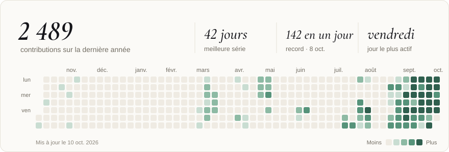
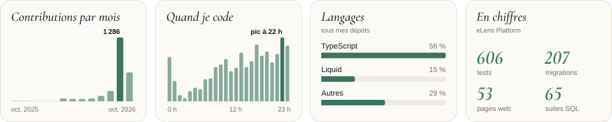

<picture>
  <source media="(prefers-color-scheme: dark)" srcset="assets/contributions-dark.svg">
  
</picture>

<picture>
  <source media="(prefers-color-scheme: dark)" srcset="assets/cartes-dark.svg">
  
</picture>

### Salut, moi c'est Melvyn 👋

Je travail sur **[eLens Technologies](https://elens.app)** : on construit une plateforme d'analyse statistique
pour des équipes d'ultimate frisbee. Je touche à tout le produit : l'app web, l'app mobile, la base
de données, et le pipeline de vision par ordinateur qui transforme la vidéo des matchs en données.

### Ce que je construis

| | Projet | Ce que ça fait | Stack |
|:-:|---|---|---|
| 🌐 | **eLens Platform** | L'espace d'équipe : calendrier et présences, playbooks, playlists vidéo, stats de match, messagerie, assistant IA | Next.js · TypeScript · Supabase |
| 📱 | **eLens Mobile** | Le même espace dans la poche, avec les notifications | Expo · React Native |
| 🎥 | **eLens Vision** | Suivi des joueurs et du disque à partir de la vidéo | PyTorch · SAM2 · RF‑DETR |

> Le code est dans des dépôts privés. Le produit, lui, est sur **[elens.app](https://elens.app)** allez jetez un coup d'oeil !

### Mes outils

🌐 [elens.app](https://elens.app) · 🗣️ Français / English
